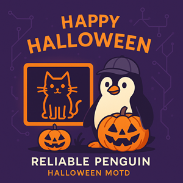

# 🎃 Reliable Penguin — Halloween MOTD


Make your servers *spooktacular* this season! This lightweight, portable script prints a Halloween‑themed Message of the Day (MOTD) with centered headers and classic ASCII art (bat, ghost, pumpkin, cat, spider). Color is off by default for maximum compatibility, and can be enabled with `--color`.

> **Why?** Because even production boxes deserve a little pumpkin spice.

---

## ✨ Features

* **Portable POSIX `sh`**: runs on CentOS 7 era shells and newer (no bash‑isms required)
* **Centered layout**: title, hostname, date, and the whole ASCII art block
* **No color by default**: optional, 16‑color ANSI with `--color`
* **Pick your familiar**: `--art=bat|ghost|pumpkin|cat|spider|random`
* **Width aware**: `--width` (or auto‑detects terminal width)
* **Safe heredocs**: ASCII art embedded with literal quoting so nothing gets mangled

---

## 📦 Installation

Copy the script onto your host and make it executable:

```sh
curl -o /usr/local/bin/halloween-motd <YOUR-SOURCE-URL>
chmod +x /usr/local/bin/halloween-motd
```

> Replace `<YOUR-SOURCE-URL>` with wherever you host the script (internal repo, Gist, etc.).

---

## 🚀 Quick Start

```sh
# Print to the terminal (no color)
/usr/local/bin/halloween-motd --stdout

# Print with color (16‑color safe)
/usr/local/bin/halloween-motd --stdout --color

# Lock in your favorite beast
/usr/local/bin/halloween-motd --stdout --art=ghost

# Explicit width (e.g., exact fit for narrow banners)
/usr/local/bin/halloween-motd --stdout --width=60
```

---

## 🔧 Options

```
--stdout              Print MOTD to stdout
--file                Write to /etc/motd (requires root)
--width N             Set banner width (also supports --width=N, -w N, -w=N)
--color               Enable ANSI color (16‑color)
--no-color            Disable color (default)
--art=NAME            pumpkin | ghost | bat | cat | spider | random
-h, --help            Show built‑in help
```

> **Note:** `--file` writes a one‑time static `/etc/motd`. If you use `update-motd.d`, see below.

---

## 🧩 Integrations

### A) Classic `/etc/motd`

Generate and install a static MOTD (run as root):

```sh
/usr/local/bin/halloween-motd --file --width=80 --color
```

### B) Debian/Ubuntu `update-motd.d`

If your system rotates scripts in `/etc/update-motd.d`, drop in a wrapper:

```sh
cat >/etc/update-motd.d/50-halloween <<'WRAP'
#!/usr/bin/env sh
/usr/local/bin/halloween-motd --stdout --color --width=80
WRAP
chmod +x /etc/update-motd.d/50-halloween
```

### C) Systemd timer (periodic refresh)

Useful if you want the art to change occasionally.

**Unit:** `/etc/systemd/system/halloween-motd.service`

```ini
[Unit]
Description=Regenerate Halloween MOTD

[Service]
Type=oneshot
ExecStart=/usr/local/bin/halloween-motd --file --color --width=80
```

**Timer:** `/etc/systemd/system/halloween-motd.timer`

```ini
[Unit]
Description=Run Halloween MOTD refresh hourly

[Timer]
OnCalendar=hourly
Persistent=true

[Install]
WantedBy=timers.target
```

Enable:

```sh
systemctl daemon-reload
systemctl enable --now halloween-motd.timer
```

---

## 🧪 Troubleshooting

* **You see `[33m` / `[0m` codes instead of colors**: your terminal/SSH may strip ESC or color; run with `--no-color` (default) or check `$TERM`.
* **Width looks off**: specify `--width=N` to match your login banner width exactly.
* **Bat looks batty**: pin a different art with `--art=ghost` (we won’t tell 🦇).
* **Permission denied writing `/etc/motd`**: use `sudo` or run with `--stdout`.

---

## License

Copyright (c) 2025 Reliable Penguin, Inc.

This project is licensed under the
[Creative Commons Attribution-NonCommercial 4.0 International License](https://creativecommons.org/licenses/by-nc/4.0/).

You are free to share and adapt this work with attribution, for non-commercial purposes only.
Commercial use requires prior written permission from Reliable Penguin, Inc.


